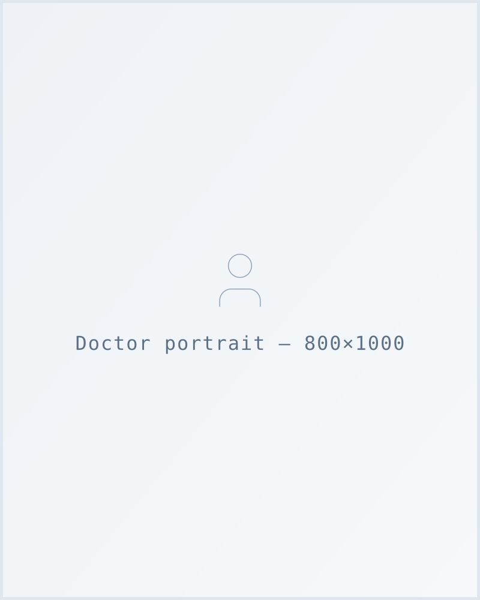
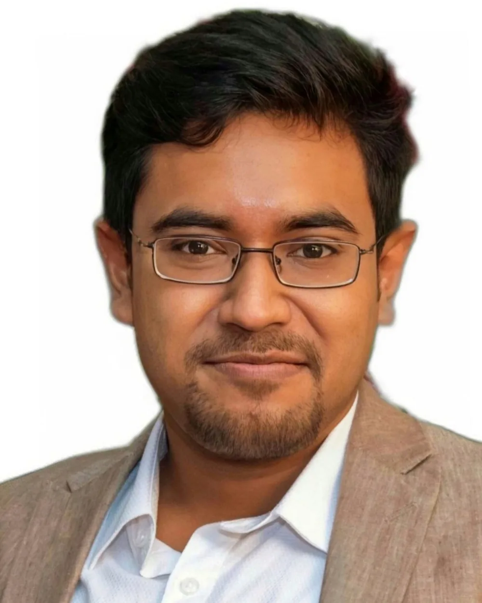

# Image brief — Ramakrishna Multispeciality Hospital, Barrackpore

Every photographic slot on the site, what belongs in it, and the exact size to deliver.

**Alt text is already written for every slot** (listed below). It describes the photograph we
expect. If a delivered photo shows something materially different, update the `alt` to match
the photo — do not leave a description that no longer describes the image.

Nothing here is decorative. Every slot is a real thing at 203/1 Ghoshpara Road.

---

## Interim — AI-generated, not this hospital, must be replaced before client sign-off

One image currently on the site is **AI-generated. It depicts a hospital that does not exist.**
It is not a photograph of Ramakrishna Multispeciality Hospital, of its reception, or of any
member of its staff. It is in place only so the homepage hero is not a grey box during build.

| File | Where it appears | Status |
|---|---|---|
| `images/interim/hero-reception-4x5.webp` | Homepage hero, desktop | **Interim — replace** |
| `images/interim/hero-reception-16x10.webp` | Homepage hero, mobile | **Interim — replace** |
| `images/interim/hero-reception-*.jpg` | Fallback for browsers without WebP | **Interim — replace** |
| `images/interim/hero-reception-master.png` | Uncropped master, not referenced by any page | **Interim — delete with the rest** |

Everything under `images/interim/` is interim by definition. **The folder should be empty and
deleted before sign-off.** To audit at any point:

```
ls images/interim/          # must be empty before go-live
grep -rn "images/interim" *.html
```

This is a disclosure item, not a taste one. A hospital website that shows a hospital which does
not exist is making a claim about premises it cannot support. It must not go to the client as
finished work, and it must not survive to production.

### P0 replacement shot list

These six frames retire the interim image and fill the slots that most damage trust while empty.
Shoot these first; everything else can follow.

| # | Shot | Deliver | Replaces |
|---|---|---|---|
| 1 | **Reception / front desk, staffed.** A real staff member at the desk, mid-task, not posed to camera. Natural light. Depth behind them — the waiting area or corridor visible and in soft focus. Keep the lower-left third free of faces: a status card overlays it. | 1600×2000 (4:5) | the interim hero |
| 2 | **Hospital exterior on Ghoshpara Road.** The building, its signage, and enough street context to be recognisable to someone arriving by auto. Daylight. | 1200×1200 (1:1) | `ph-building-1x1` |
| 3–6 | **Doctor portraits ×4** — Dr. Gourab Chatterjee, Dr. Shyan Kumar Biswas, Dr. Debosmita Roy, Dr. Aniket Sarkar. See *Portrait set* below — these four must be shot as one set. | 1600×2000 (4:5) each | `ph-portrait-4x5`, `ph-portrait-3x4` |

**The hero is one shot, two crops.** Deliver 1600×2000 (4:5). The mobile 16:10 frame is a
1600×1000 centre crop of the same file — do not shoot it separately, or the two break composition
at the responsive switch.

---

## Portrait set — read before shooting the doctors

The four portraits appear together in a four-across grid on the homepage, on `/all-doctors`, and
on the landing page. **They will be seen side by side.** Four portraits shot on different days,
in different rooms, at different focal lengths read as four unrelated photographs pasted into a
grid — which is exactly how the current placeholder grid reads, and the single biggest reason
that block looks unfinished.

So:

- **One background** for all four. One wall, one location, one session if at all possible.
- **One focal length** and one camera distance. Head-and-shoulders, same crop on every subject.
- **One lighting setup.** Do not mix window light on one and flash on another.
- **Same eyeline height** — adjust the stand, not the subject's posture.
- Whites coats / scrubs / formals: pick one convention and hold it across all four.
- Frame with headroom. The site crops to 4:5 with `object-position: top center`, so leave space
  above the head and do not put anything critical in the bottom fifth.

Delivered at 1600×2000, the same master serves both the 4:5 card and the 3:4 profile-page crop.

---

## P0 — ship-blocking

Empty here reads as "unfinished" or "fake" to a first-time visitor.

| Slot | Deliver | Ratio | Subject | Alt text already written |
|---|---|---|---|---|
| Homepage hero | 1600×2000 | 4:5 | Reception, staffed — see P0 #1 | *Reception at Ramakrishna Multispeciality Hospital, Barrackpore* |
| `ph-building-1x1` — `about-us`, `index`, `who-we-are` (3 slots) | 1200×1200 | 1:1 | Hospital exterior on Ghoshpara Road | *Ramakrishna Multispeciality Hospital building in Barrackpore* |
| `ph-portrait-4x5` — `index`, `all-doctors`, `landing`, `department-*` (16 slots, 4 people) | 1600×2000 | 4:5 | Doctor portraits — one set | *Dr. Gourab Chatterjee, Orthopaedics* · *Dr. Shyan Kumar Biswas, General Medicine* · *Dr. Debosmita Roy, Gynaecology & Obstetrics* · *Dr. Aniket Sarkar, Dental — Oral & Maxillofacial Surgery* |
| `ph-portrait-3x4` — `doctor-1..4` (4 slots) | crop of the above | 3:4 | Same four people, profile-page crop | *Dr. …, [speciality] specialist* |

---

## P1 — high value

| Slot | Deliver | Ratio | Subject | Alt text already written |
|---|---|---|---|---|
| `ph-diagnostic-1x1` — `index`, `all-services` (2 slots) | 1200×1200 | 1:1 | In-house pathology lab or radiology, equipment and a technician at work | *In-house diagnostic laboratory at Ramakrishna Multispeciality Hospital* |
| `ph-facility-4x3` — `about-us`, `who-we-are`, `service-1`, `service-2` (5 slots) | 1200×900 | 4:3 | Care team with a patient; hospitality/reception context | *Care team attending to a patient…* · *Care and hospitality at…* · *Emergency and trauma care at…* · *Critical care team at…* |
| **Empanelment logos** — `index` (21 slots, 60+ total) | 320×160 | 2:1 | Official logo, transparent PNG or SVG | decorative (`alt=""`); the scheme name beside it is the accessible label |
| `ph-department-2x1` — 15 department pages + `all-services` (16 slots) | 1600×800 | 2:1 | The actual room for that department — see table below | one per department, listed below |

### Department banners — 16 slots, one per page

Each needs its own room. A generic corridor used sixteen times will be noticed.

| Page | Subject | Alt text already written |
|---|---|---|
| `department-emergency-critical-care` | Emergency department | Emergency department at Ramakrishna Multispeciality Hospital, Barrackpore |
| `department-nicu-picu` | NICU / PICU | Neonatal and paediatric intensive care unit at… |
| `department-single` (Cardiology) | Echo / ECG / TMT area | Cardiology diagnostics at… |
| `department-gastroenterology` | Endoscopy suite | Endoscopy suite at… |
| `department-dialysis` | Dialysis unit | Dialysis unit at… |
| `department-ent` | ENT examination room | ENT examination room at… |
| `department-general-medicine` | Physician consultation room | General Medicine consultation room at… |
| `department-general-laparoscopic-surgery` | Operating theatre | Operating theatre at… |
| `department-orthopaedics` | Orthopaedics / C-arm | Orthopaedics department at… |
| `department-gynaecology-obstetrics` | Labour room / OBG consult | Gynaecology and obstetrics department at… |
| `department-paediatrics-neonatology` | Paediatrics area | Paediatrics department at… |
| `department-pulmonology` | PFT / bronchoscopy | Pulmonology department at… |
| `department-urology` | Urology consult | Urology department at… |
| `department-endocrinology` | Endocrinology consult | Endocrinology consultation at… |
| `department-dentistry` | Dental surgery | Dental surgery at… |
| `all-services` | Radiology / X-ray | Radiology and X-ray imaging at… |

---

## P2 — can wait

| Slot | Deliver | Ratio | Subject | Notes |
|---|---|---|---|---|
| `ph-article-8x5` — `index` (3), `blog-listing` (6), `single-post` (1) | 1280×800 | 8:5 | One image per article, on-topic | 7 unique articles; alt text is per-article and already written |
| `ph-facility-4x3` — `gallery` (20 slots) | 1200×900 | 4:3 | Reception · waiting area · consultation room · ward · nursing station · critical care · imaging · pathology lab · OT · emergency · pharmacy · private room · corridor · care team · help desk · treatment room · day-care · equipment · patient care space · building exterior | Each has its own alt text; the gallery lightbox links to the same file, so one delivery per slot |

---

## Delivery spec

**Format.** Deliver full-quality JPEG or PNG at the sizes above. We convert to WebP with a JPEG
fallback at build; do not pre-compress.

**Colour.** sRGB. Strip EXIF orientation before delivery.

**Faces.** Every identifiable patient needs written consent on file before their photo ships.
Staff too. If consent is uncertain, shoot the room without them in it — an empty, clean,
well-lit room is far better than a consent problem.

**No stock.** Every slot is for a real photograph of this hospital. Do not fill a gap with a
stock library image, and do not fill one with a generated image — that is the exact problem
the Interim section above exists to close out.

### Swapping a placeholder for a real photo

Each slot is a plain `` with `width`/`height` set to the delivered dimensions, inside a
container that fixes `aspect-ratio`. Swapping is a one-line change and causes **no layout shift**
as long as the delivered file matches the ratio in the tables above.

```html
<!-- before -->

<!-- after -->

```

The 21 empanelment slots render as **text pills** rather than images until real logos exist —
a tidy field of scheme names reads as deliberate where a field of grey boxes reads as broken.
The markup is built so a pill becomes an `` with a one-line change.

---

## The placeholder system

`images/placeholders/*.svg` are **designed pending states**, not broken images: a soft diagonal
`--surface-2 → --surface` gradient, a centred line icon matching the slot's subject, and a
monospace caption naming what belongs there and at what size.

| File | Ratio | Icon | Caption |
|---|---|---|---|
| `ph-portrait-4x5.svg` | 4:5 | person | Doctor portrait — 800×1000 |
| `ph-portrait-3x4.svg` | 3:4 | person | Doctor portrait — 900×1200 |
| `ph-building-1x1.svg` | 1:1 | building | Hospital exterior — 1200×1200 |
| `ph-diagnostic-1x1.svg` | 1:1 | microscope | Diagnostics — 1200×1200 |
| `ph-facility-4x3.svg` | 4:3 | building | Facility photo — 1200×900 |
| `ph-article-8x5.svg` | 8:5 | image | Article image — 1280×800 |
| `ph-department-2x1.svg` | 2:1 | stethoscope | Department banner — 1600×800 |

Token hexes are hardcoded in each SVG — an `` is an isolated document and cannot
read the page's custom properties. If the neutral tokens change in `css/rk-system.css`, update
these seven files to match.
